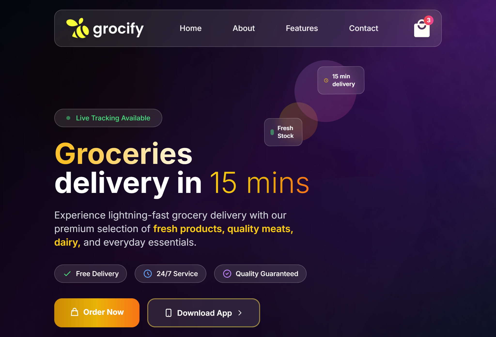
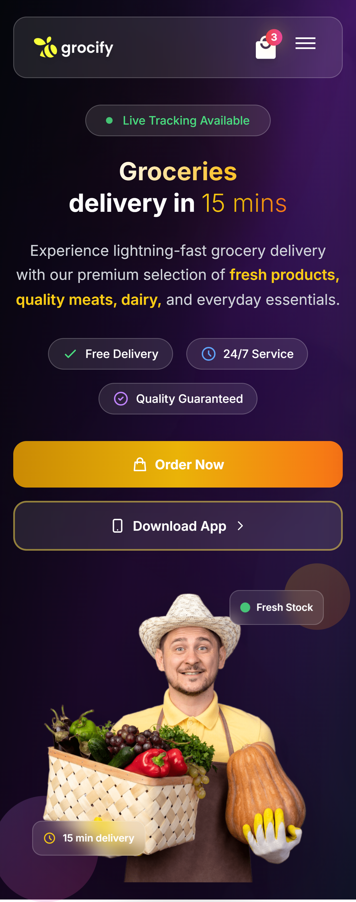
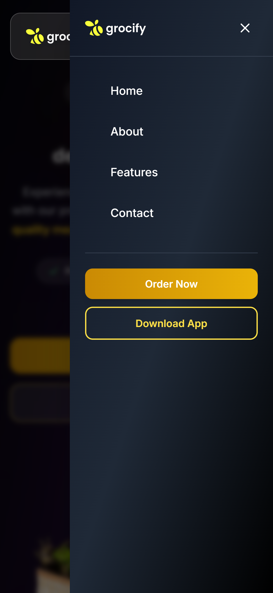

# 🛒 Grocify - Instant Grocery Delivery Landing Page

Grocify is a visually engaging, fully responsive landing page designed for a modern grocery delivery service. Built with **Tailwind CSS**, this page provides a sleek interface with animated elements, gradient overlays, and glassmorphism to enhance the user experience across desktop and mobile devices.

## 🚀 Features

- 🔥 Hero section with glowing highlights and animated backgrounds
- 📱 Fully responsive design optimized for desktop and mobile views
- 🌙 Glassmorphism effects for modern UI aesthetic
- 🌈 Shimmering text and animated elements for visual engagement
- 📦 Mobile sidebar menu with animated hamburger button
- ✅ Interactive call-to-action buttons
- 📸 Parallax and hover animations for depth and responsiveness

## 📷 Screenshots

### 🖥️ Desktop View


### 📱 Mobile View


### 📂 Sidebar Open (Mobile)


## 🛠️ Built With

- HTML5
- Tailwind CSS (via CDN)
- JavaScript (Vanilla)

## 💡 Getting Started

1. Clone the repo or download the HTML file.
2. Ensure the following folder structure is maintained:

```

project-root/
├── index.html
├── images/
│   ├── logo.png
│   ├── cart.png
│   └── grocery-image.png
├── screenshots/
│   ├── desktop-view\.png
│   ├── mobile-view\.png
│   └── sidebar-open.png

```

3. Open `index.html` in your browser.

## 📱 Responsive Design

This landing page adapts seamlessly from large desktop screens to compact mobile phones, with a collapsible sidebar menu for mobile navigation.

## 📦 License

This project is open-source and free to use for personal or commercial purposes. Attribution appreciated!

---

Feel free to customize this file further to match your branding or deployment info.
